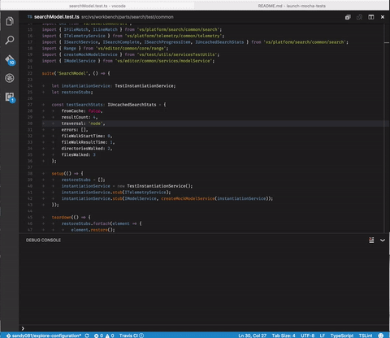

# Launch Mocha Tests

This extensions provides a command `launchMochaTests.debugTest` to run the mocha tests for the current active editor.
This command works for `typescript` and `javascript` files only. For `typescript` file this extensions looks for the generated
`javascript` file in `out` directory in the workspace. If you have a different out directory in your workspace you can
specify it using the configuration property `launch.mocha.ts.outDir`

**NOTE:** This extension requires `mocha` library installed in the workspace